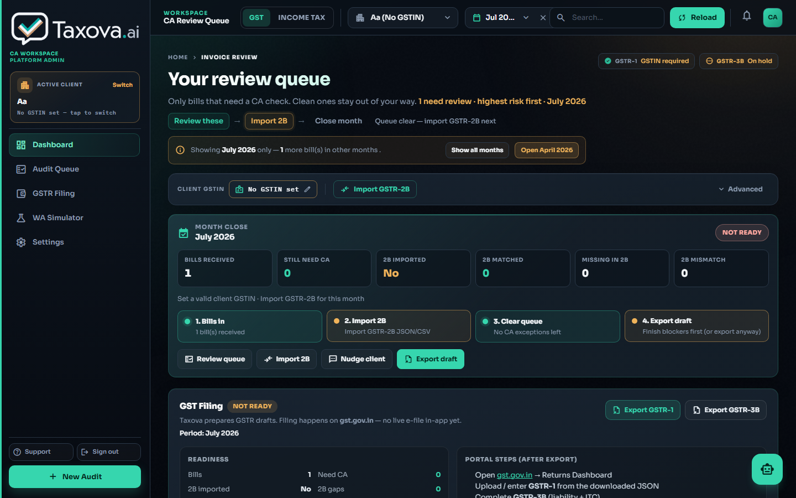
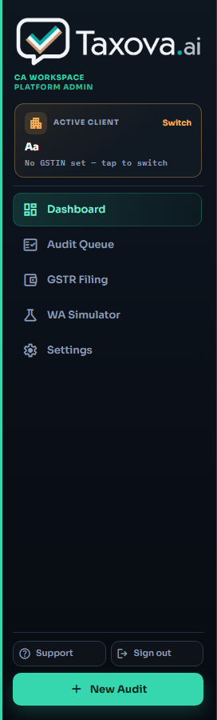
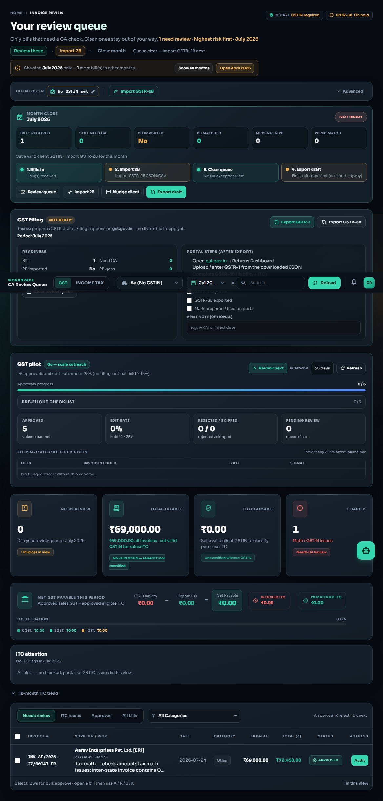
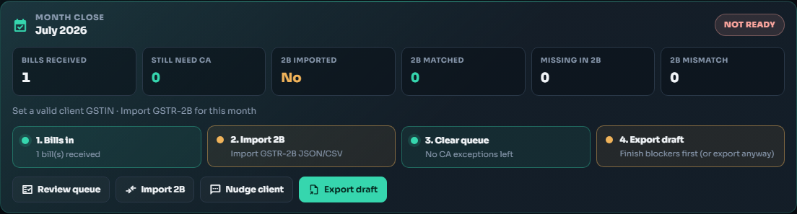
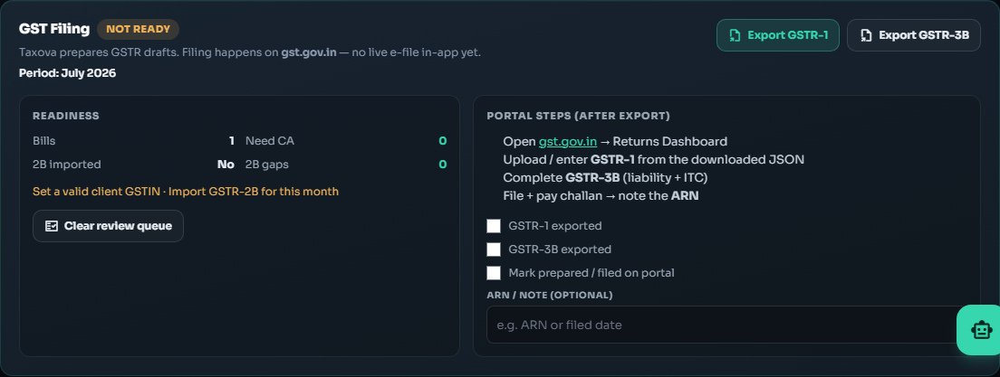
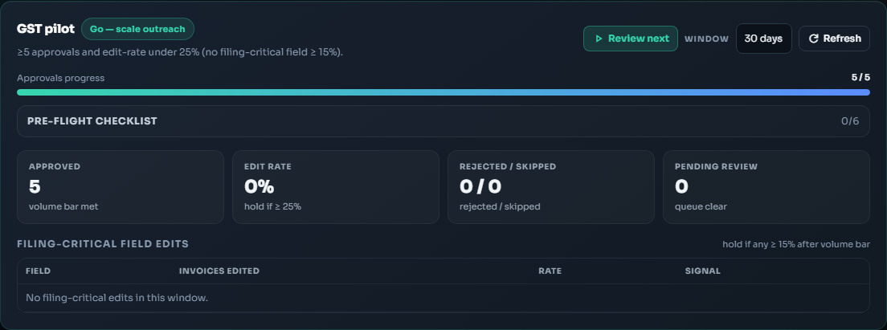
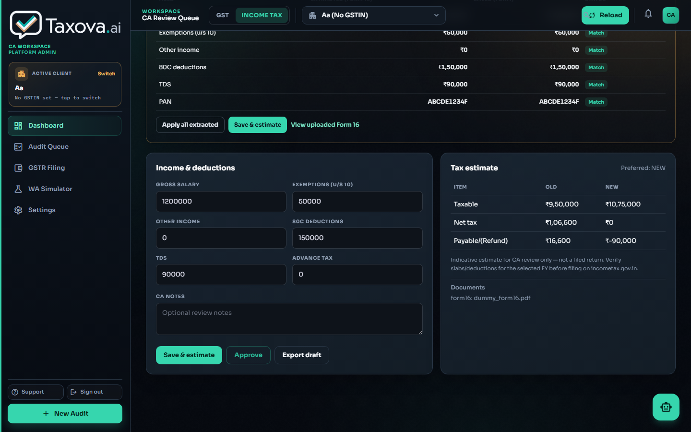
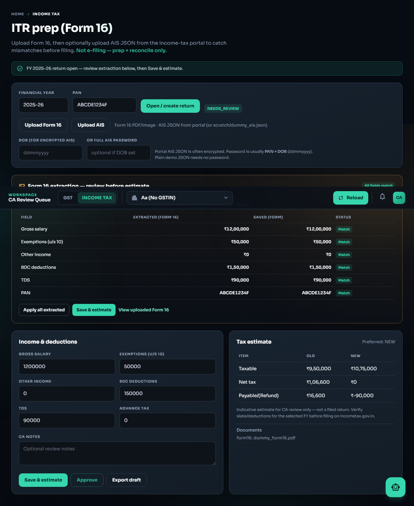
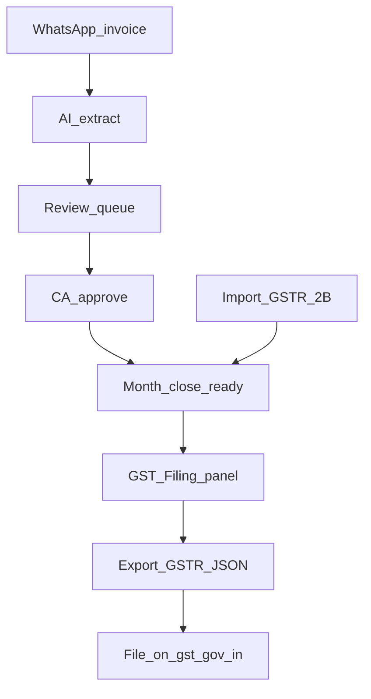

# Taxova CA Dashboard — Part-by-part guide

This document explains **every major area** of the CA dashboard (`/dashboard`): what it is for, what you click, and how it fits the WhatsApp → review → filing-prep flow.

Screenshots were captured from a local run (dark UI). Paths are relative to this repo.

---

## 1. Big picture

```text
WhatsApp (client)          CA Dashboard                         Government
─────────────────          ───────────────────────────          ────────────
Invoice photo/PDF ──AI──►  Review queue / edit / approve
                           Month close + 2B reconcile
                           GST Filing → export JSON  ────────►  gst.gov.in
Form 16 / AIS     ──────►  Income Tax module                    (file there)
```

**Taxova prepares.** Portal filing (GST) still happens on **gst.gov.in**.



| Zone | What it is |
|------|------------|
| **A — Sidebar** | Navigation + active client + sign out |
| **B — Top header** | GST / Income Tax switch, client, month, search, reload |
| **C — Main GST body** | Review queue hero, GSTIN bar, month close, filing, pilot, invoice table |

---

## 2. Sidebar (left)



| Part | Purpose |
|------|---------|
| **Taxova.ai logo** | Brand / home feel |
| **CA WORKSPACE** | Shows you are in the CA product (admin key may show “PLATFORM ADMIN”) |
| **Active client card** | Who you are reviewing right now. **Switch** focuses the client picker / clients nav |
| **Dashboard** | Main GST review home |
| **Audit Queue** | Jumps to Needs review / invoice table |
| **GSTR Filing** | Scrolls to the **GST Filing** panel (prep + export, not live e-file) |
| **WA Simulator** | Test WhatsApp uploads without Meta (local / staging) |
| **Settings** | CA login, API key, logout |
| **Support** | Shortcuts / help |
| **Sign out** | End CA session for this firm |
| **+ New Audit** | Open next bill that needs review |

**If you see “Select a client” / “No clients yet”:** no clients are linked to this login. Use [`/ca-assign`](https://taxova.pro/ca-assign) or an admin key on a DB that already has clients. See also `docs/PILOT_RUNBOOK.md`.

---

## 3. Top header


| Part | Purpose |
|------|---------|
| **Workspace · CA Review Queue** | Context label (hides on narrower screens) |
| **GST \| Income Tax** | Module switch. GST = invoices & filing prep. Income Tax = Form 16 / AIS / estimates |
| **Client dropdown** | Pick which taxpayer you are working on (phone + name + GSTIN) |
| **Month picker** | Filter invoices / month-close / filing to one return period (e.g. `Jul 2026`) |
| **Search** | Filter invoice list by number / supplier / GSTIN |
| **Reload** | Refresh invoices + metrics + pilot stats from the server |
| **Bell / CA chip** | Notifications placeholder · session indicator |

**Tip for demos:** always pick a **client with GSTIN** and a **month that has bills**, or month close / filing will show “Not ready”.

---

## 4. GST module — review hero & context



### 4.1 Page title row

| Part | Purpose |
|------|---------|
| **Your review queue** | Home for CA exception review |
| **GSTR-1 / GSTR-3B chips** | Local readiness (not portal filing status) |
| **Review these / Import 2B / Close month** | Shortcuts into queue, 2B import, month-close strip |

### 4.2 Client GSTIN bar

| Part | Purpose |
|------|---------|
| **Client GSTIN** | Required for ITC classification and clean exports. Click to edit |
| **Import GSTR-2B** | Upload portal 2B JSON/CSV and reconcile purchases |
| **Advanced** | Pull 2B (OTP), recompute ITC, GSTIN lookup |

---

## 5. Month close



**Purpose:** Answer “Can we close this return month?” before export.

| Part | Purpose |
|------|---------|
| **Period + Ready / Not ready** | Selected month + blocker summary |
| **Bills received** | Count of invoices in this month |
| **Still need CA** | Exceptions still open |
| **2B imported / matched / missing / mismatch** | Purchase reconcile health |
| **Steps 1–4** | Bills in → Import 2B → Clear queue → Export draft |
| **Review queue** | Jump to Needs review |
| **Import 2B** | Open import modal |
| **Nudge client** | WhatsApp nudge for missing bills |
| **Export draft** | Open GSTR JSON export modal |

Blockers commonly include: missing GSTIN, no month selected, bills still needing CA, 2B not imported.

---

## 6. GST Filing (Phase 1)



**Purpose:** Turn “month is ready” into **download drafts + portal checklist**. Taxova does **not** submit to gst.gov.in yet.

| Part | Purpose |
|------|---------|
| **Ready / Not ready badge** | Same readiness idea as month close |
| **Export GSTR-1 / GSTR-3B** | Download offline-utility-style JSON |
| **Readiness stats** | Bills, need CA, 2B imported, 2B gaps |
| **Clear review queue** | Fix blockers first |
| **Portal steps** | What to do on gst.gov.in after download |
| **GSTR-1 / 3B exported checkboxes** | Auto-tick after successful download (browser memory) |
| **Mark prepared / ARN note** | CA tracking only (localStorage) — not a legal ARN |

Details: [`docs/GST_FILING.md`](GST_FILING.md).

---

## 7. GST pilot panel



**Purpose:** Founder / ops gate — “Is extraction good enough to scale?” — **not** day-to-day filing.

| Part | Purpose |
|------|---------|
| **Status pill** | Collecting / check-in / Go / Hold |
| **Approvals progress** | Toward volume bar (default **25**; local demo may override via `PILOT_MIN_APPROVALS`) |
| **Review next** | Open next firm-wide pending bill (easy ones first) |
| **Edit rate** | Locked until volume bar; then % of approved bills you edited |
| **Rejected / skipped** | Volume outside edit-rate |
| **Pending review** | Clickable → same as Review next |
| **Pre-flight checklist** | Your day-zero / firm / training checklist |
| **Filing-critical field table** | GSTIN / totals / invoice # edits |

Criteria: [`docs/PILOT_CRITERIA.md`](PILOT_CRITERIA.md) · Runbook: [`docs/PILOT_RUNBOOK.md`](PILOT_RUNBOOK.md).

---

## 8. Invoice review table (queue)


| Part | Purpose |
|------|---------|
| **Tabs** (Needs review / Pending / Approved / ITC / All) | Filter the work list |
| **Row** | One WhatsApp (or uploaded) invoice |
| **Risk / reason** | Why it needs a CA (calc, GSTIN, 2B, ITC, etc.) |
| **Open / Approve** | Drawer audit or quick approve when ready |
| **Bulk bar** | Multi-select approve |

**Typical CA loop:** Needs review → open bill → fix fields if needed → Approve → next.

---

## 9. Income Tax module





Switch with the header **Income Tax** tab (same client).

| Part | Purpose |
|------|---------|
| **FY + PAN + Open / create return** | One ITR return per client + year |
| **Upload Form 16** | PDF/image → AI extract salary / TDS / exemptions |
| **Upload AIS** | Portal/demo AIS JSON → reconcile vs Form 16 (no ERI) |
| **Salary / TDS / 80C fields** | Editable estimate inputs |
| **Save estimate** | Old vs new regime comparison |
| **AIS vs Form 16 table** | Mismatches (e.g. interest income) |
| **Approve / Export draft** | CA sign-off + prep for portal filing (not e-file inside Taxova) |

---

## 10. How the pieces connect (GST)



---

## 11. Login modes (why the UI looks empty)

| Mode | How | What you see |
|------|-----|--------------|
| **CA session** | Settings → invite + password | Only clients linked via `/ca-assign` for that invite |
| **Platform admin API key** | Settings → paste `DASHBOARD_API_KEY` | All clients in the DB (ops only — do not give to customer CAs) |

**Production “No clients yet”** with a valid CA login almost always means: **no `client_ca_links` for that invite** on Railway’s database (local SQLite can still have many clients).

---

## 12. Refreshing screenshots

With the local server running:

```bash
python scratch/capture_dashboard_docs.py
```

Images land in `docs/images/dashboard/`.

---

## Related docs

| Doc | Topic |
|-----|--------|
| [`GST_FILING.md`](GST_FILING.md) | Filing Phase 1 handoff |
| [`PILOT_CRITERIA.md`](PILOT_CRITERIA.md) | 25-approval go/hold rules |
| [`PILOT_RUNBOOK.md`](PILOT_RUNBOOK.md) | How to run the pilot |
| [`EXTRACTION_EDIT_RATE.md`](EXTRACTION_EDIT_RATE.md) | Edit-rate metric |
